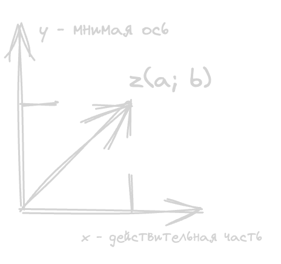

- **i** - мнимая единица
	- $$i = \sqrt{-1}$$
	- $$(i)^2 = (\sqrt{-1})^2 \rightarrow i^2 = -1$$
- Алгебраическая форма
	- C - множество комплексных чисел
	- $$z = a + bi$$
		- a - действительная часть
		- b - мнимая часть
- Геометрическая форма
	- Комплексные числа изображаются в виде точки $$z(a;b)$$ или радиус-вектора
	- {:height 266, :width 232}
- Действия
	- $$z_1 = a_1+ ib_1 \quad z_2= a_2+ ib_2$$
	- $$z_1 + z_2 = (a_1+b_1) + (a_2+b_2) \\ z_1 - z_2 = (a_1 + b_1) - (a_2 - b_2) 
	  \\ z_1 * z_2 = (a_1 )$$