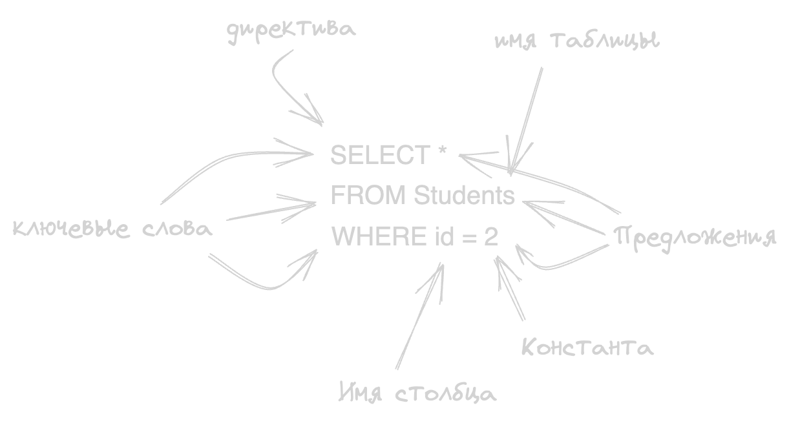

- SQL - язык для взаимодействия с БД
- 
- **Предложение** описывает данные, с которыми работает оператор, или содержит уточняющую информацию о действии, выполняемом оператором:
	- *FROM*, *WHERE*, *GROUP BY*, *HAVING*, *ORDER BY*, *INTO*
- Имена (идентификаторы)
	- длина - до 128 символов
	- используемые символы - только прописные или строчные буквы латинского алфавита, цифры или символ подчеркивания (_). Первым символом должна быть буква
	- составное имя - идентификатор базы данных, её владельца и (или) объекта БД
- Комментарии
	- /* */
	- --
- [[основы проектирования баз данных/язык SQL/операторы]]